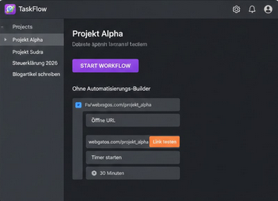

<div align="center">
  
  <h1 align="center">TaskFlow</h1>

  <p align="center">
    <strong>TaskFlow ist ein Open-Source Automatisierungstool, das die Lücke zwischen statischen To-Do-Listen und aktiven System-Workflows schließt.</strong>
  </p>

  <p align="center">
    TaskFlow wurde entwickelt, um tägliche Routinen zu vereinfachen, indem Aufgaben direkt mit ausführbaren Systemaktionen verknüpft werden. Gebaut mit Node.js (Electron, Vue, TypeScript).
  </p>

  <p align="center">
    
    
    <a href="#">
      
    </a>
  </p>

  <br/>
  
  

</div>

---

## Features

- **Visueller Workflow-Builder**: Erstelle komplexe Automatisierungen intuitiv per Drag-and-Drop.
- **Modulare Bausteine**: Nutze vorgefertigte Aktionen wie Programmstarts, URL-Aufrufe oder Shell-Skripte.
- **Echtzeit-Synchronisation**: Dank Supabase sind deine Workflows auf all deinen Geräten sofort verfügbar.
- **Native System-Integration**: Tiefe Betriebssystem-Anbindung durch Electron für maximale Kontrolle.
- **Fokus-Modus**: Minimiere Ablenkungen, indem du dein gesamtes Arbeits-Setup mit nur einem Klick vorbereitest.

## Tech Stack

TaskFlow nutzt moderne Technologien für eine performante und sichere Desktop-Erfahrung:

- **Frontend**: [Vue.js 3](https://vuejs.org/) & [Tailwind CSS](https://tailwindcss.com/)
- **DesignComponents**: [Shadcn/vue](https://www.shadcn-vue.com/docs/components)
- **Runtime**: [Electron](https://www.electronjs.org/) & [Node.js](https://nodejs.org/)
- **Sprache**: [TypeScript](https://www.typescriptlang.org/)
- **Backend**: [Supabase](https://supabase.com/) (PostgreSQL & Realtime)

## Build from source

Um TaskFlow lokal zu bauen, folge diesen Schritten:

1. Repository klonen:
   ```bash
   git clone [https://github.com/BasementKirill/TaskFlow.git](https://github.com/BasementKirill/TaskFlow.git)
   npm init
   npm run dev
